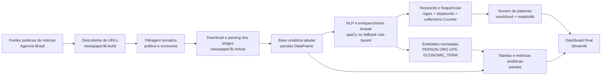
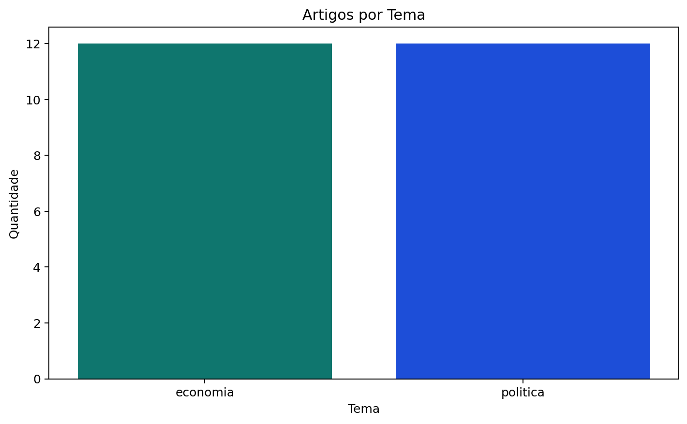
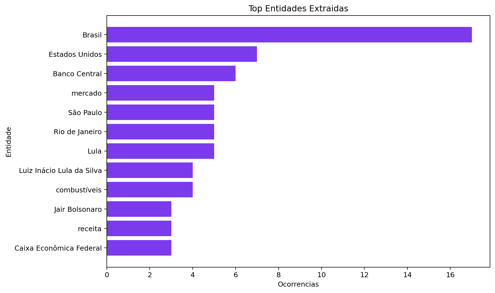
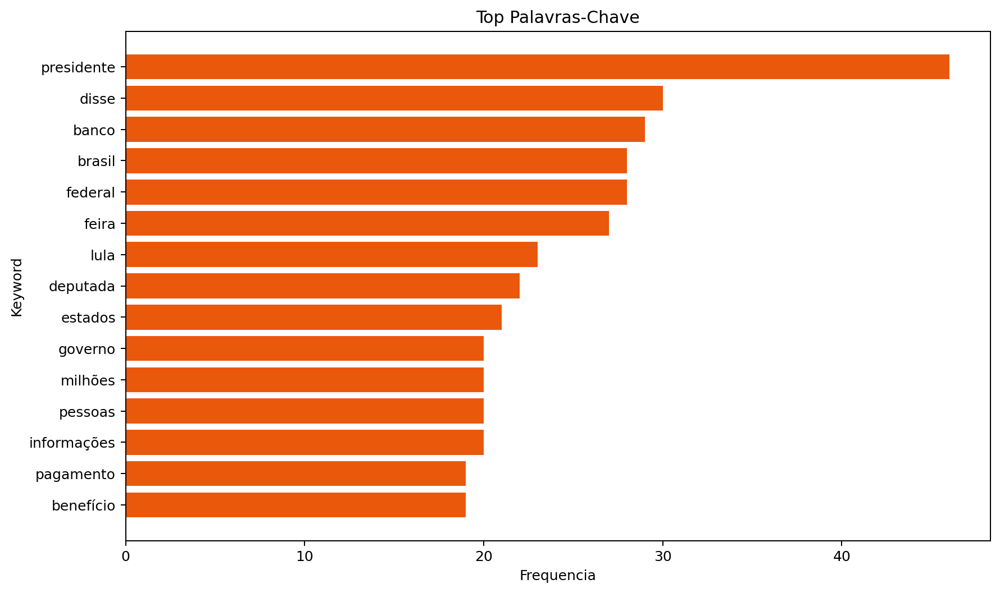
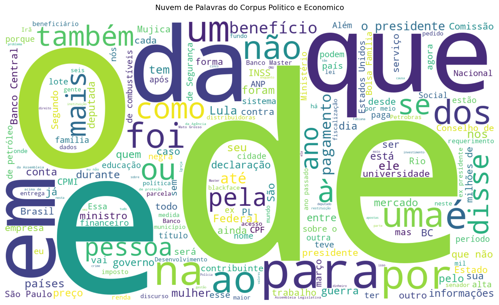
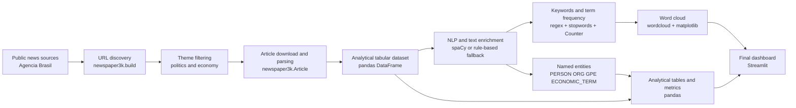

# Political and Economic News Intelligence Dashboard

## PT-BR

Projeto de `web scraping` com `newspaper3k` para coletar notícias de temas políticos e econômicos, combinado com `spaCy` para NER, estatísticas textuais, nuvem de palavras e dashboard interativo em `Streamlit`.

O projeto foi desenhado como uma reprodução publicável de um fluxo de monitoramento institucional: coleta de notícias, extração de texto, enriquecimento com NLP e visualização executiva.

## Fluxograma do processo



Ferramentas usadas no fluxo:
- `newspaper3k`: descoberta de links e parsing dos artigos
- `pandas`: estruturação da base analítica
- `spaCy`: NER quando disponível
- `fallback rule-based`: continuidade do pipeline em ambientes sem spaCy funcional
- `wordcloud` e `matplotlib`: visualizações textuais
- `Streamlit`: dashboard interativo final

## Resultados da execução atual

- `24` artigos coletados automaticamente da `Agência Brasil`
- cobertura equilibrada: `12` de `política` e `12` de `economia`
- `92` entidades extraídas
- datas de publicação disponíveis em todos os artigos coletados
- principais entidades encontradas: `Brasil`, `Estados Unidos`, `Banco Central`, `Lula`
- palavras-chave mais frequentes após limpeza: `banco`, `brasil`, `lula`, `estados`, `deputada`

Fonte pública usada nesta execução:
- [Agência Brasil](https://agenciabrasil.ebc.com.br/)

## Exemplos visuais

**Distribuição por tema**



**Entidades mais frequentes**



**Palavras-chave mais frequentes**



**Nuvem de palavras**



## O que o projeto faz

- descobre URLs de notícias em temas de `política` e `economia`
- baixa e parseia o conteúdo dos artigos com `newspaper`
- organiza os textos em uma base analítica
- aplica NER com `spaCy` quando disponível
- usa fallback rule-based quando `spaCy` não está operacional no ambiente
- gera palavras-chave frequentes
- cria nuvem de palavras
- exibe tudo em um dashboard `Streamlit`

## Stack técnico

- `newspaper3k`
  Para descoberta e parsing dos artigos.
- `spaCy`
  Para NER e processamento linguístico quando o modelo está disponível.
- `pandas`
  Para estruturação da base analítica.
- `wordcloud`
  Para a nuvem de palavras.
- `matplotlib`
  Para visualizações auxiliares.
- `streamlit`
  Para o dashboard final.

## Técnicas usadas

- `URL discovery` com filtragem por padrões temáticos
  Para separar notícias de `política` e `economia`.
- `Article parsing`
  Para extrair título, autoria, data, texto e resumo.
- `Named Entity Recognition`
  Feito com `spaCy` quando o ambiente suporta um modelo compatível.
- `Rule-based entity fallback`
  Mantém o pipeline funcional mesmo quando há incompatibilidade do `spaCy`.
- `Keyword extraction`
  Baseada em tokenização regex e remoção de stopwords em português.
- `Word cloud`
  Para destacar termos recorrentes no corpus coletado.
- `Dashboard analytics`
  Métricas, linha do tempo, entidades e tabela final para exploração interativa.

## Estrutura

- [app.py](./app.py): dashboard em Streamlit
- [scripts/build_dataset.py](./scripts/build_dataset.py): scraping + NLP + geração de datasets
- [src/scraper.py](./src/scraper.py): descoberta e parsing dos artigos
- [src/nlp_pipeline.py](./src/nlp_pipeline.py): NER, keywords e metadados NLP
- [src/dashboard_utils.py](./src/dashboard_utils.py): carregamento e renderização
- [tests/test_pipeline.py](./tests/test_pipeline.py): teste automatizado

## Como executar

```bash
python3 -m venv .venv
source .venv/bin/activate
pip install -r requirements.txt
python3 scripts/build_dataset.py
streamlit run app.py
```

## Observação importante sobre spaCy

`spaCy` funciona melhor em `Python 3.11` ou `3.12`. Neste ambiente atual, o `Python 3.14` pode quebrar partes internas do `spaCy`, então o projeto implementa fallback para continuar funcional.

Isso significa:

- em ambiente compatível, o NER roda com `spaCy`
- em ambiente incompatível, o dashboard continua operando com fallback rule-based

## EN

`Web scraping` project built with `newspaper3k` to collect political and economic news, combined with `spaCy` for NER, textual statistics, word cloud generation, and a `Streamlit` dashboard.

The project was designed as a publishable reproduction of an institutional monitoring workflow: news collection, text extraction, NLP enrichment, and executive visualization.

## Process flowchart



Tools used across the pipeline:
- `newspaper3k`: link discovery and article parsing
- `pandas`: analytical dataset construction
- `spaCy`: NER when available
- `rule-based fallback`: keeps the NLP pipeline usable in incompatible environments
- `wordcloud` and `matplotlib`: text visualizations
- `Streamlit`: final interactive dashboard

## What the project does

- discovers news URLs in `politics` and `economy`
- downloads and parses full article content with `newspaper`
- organizes texts into an analytical dataset
- applies NER with `spaCy` when available
- uses a rule-based fallback when `spaCy` is not operational in the environment
- generates frequent keywords
- builds a word cloud
- displays everything in a `Streamlit` dashboard

## Technical stack

- `newspaper3k`
  For article discovery and parsing.
- `spaCy`
  For NER and linguistic processing when the model is available.
- `pandas`
  For the analytical dataset.
- `wordcloud`
  For the word cloud.
- `matplotlib`
  For auxiliary plots.
- `streamlit`
  For the final dashboard.

## Structure

- [app.py](./app.py): Streamlit dashboard
- [scripts/build_dataset.py](./scripts/build_dataset.py): scraping + NLP + dataset generation
- [src/scraper.py](./src/scraper.py): article discovery and parsing
- [src/nlp_pipeline.py](./src/nlp_pipeline.py): NER, keywords, and NLP metadata
- [src/dashboard_utils.py](./src/dashboard_utils.py): loading and rendering helpers
- [assets/](./assets): generated charts and word cloud previews
- [tests/test_pipeline.py](./tests/test_pipeline.py): automated test

## Run

```bash
python3 -m venv .venv
source .venv/bin/activate
pip install -r requirements.txt
python3 scripts/build_dataset.py
streamlit run app.py
```

## Important note about spaCy

`spaCy` works best on `Python 3.11` or `3.12`. In the current environment, `Python 3.14` may break some of spaCy's internal dependencies, so the project includes a fallback path to remain usable.

This means:

- on a compatible environment, NER runs with `spaCy`
- on an incompatible environment, the dashboard still works with a rule-based fallback

## Current run results

- `24` articles automatically collected from `Agência Brasil`
- balanced coverage: `12` from `politics` and `12` from `economy`
- `92` extracted entities
- publication dates available for all collected articles
- top entities found: `Brasil`, `Estados Unidos`, `Banco Central`, `Lula`
- most frequent cleaned keywords: `banco`, `brasil`, `lula`, `estados`, `deputada`

Public source used in this execution:
- [Agência Brasil](https://agenciabrasil.ebc.com.br/)

## Visual examples

**Theme distribution**


**Most frequent entities**


**Most frequent keywords**


**Word cloud**


## Techniques used

- `URL discovery` with theme-based filtering
  To separate `politics` and `economy` stories.
- `Article parsing`
  To extract title, authorship, publication date, full text, and summary.
- `Named Entity Recognition`
  Performed with `spaCy` when a compatible model is available.
- `Rule-based entity fallback`
  Keeps the pipeline operational even when `spaCy` is incompatible with the runtime.
- `Keyword extraction`
  Based on regex tokenization and Portuguese stopword removal.
- `Word cloud`
  Used to highlight recurrent terms in the collected corpus.
- `Dashboard analytics`
  Metrics, publication timeline, entities, and a final article table for interactive exploration.
